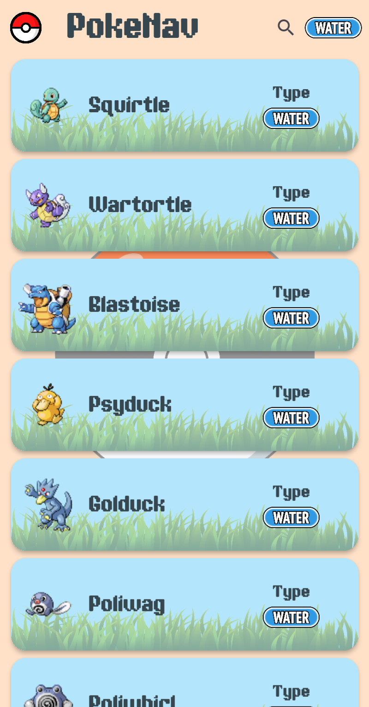
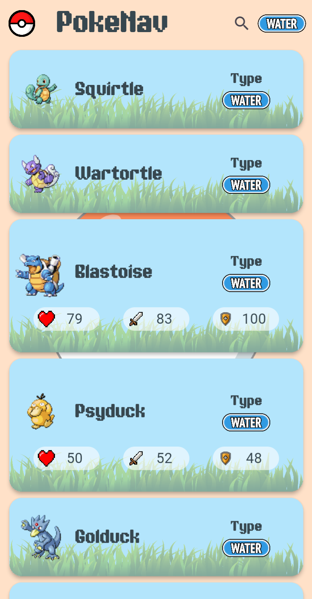

# PokéNav

A mobile application built with Flutter that consumes the PokéAPI to display Pokémon data with search, filtering, and pagination.

### 📸 Screenshots

<table align="center">
  <tr>
    <td align="center">
      <div>
        <br/>
        <em>Home Screen</em>
      </div>
    </td>
    <td align="center">
      <div>
        <br/>
        <em>Type Filtering</em>
      </div>
    </td>
    <td align="center">
      <div>
        <br/>
        <em>Name Search</em>
      </div>
    </td>
    <td align="center">
      <div>
        <br>
        <em>Pokémon Details</em>
      </div>
    </td>
  </tr>
</table>

### ✨ Features

- Browse Pokémon with pagination
- Filter Pokémon by type (10 supported types)
- Search Pokémon by name
- View detailed stats (HP, Attack, Defense)

### 🛠 Tech Stack

- Flutter (Dart)
- REST API integration
- JSON parsing

### 🔗 API

Data provided by [PokéAPI](https://pokeapi.co/)

---

### 📥 Download

You can download and install the latest APK from the Releases section.

> [!NOTE]
> You may need to enable "Install from unknown sources" on your Android device.

### 📋 Requirements

- Flutter SDK (>=3.41.2)
- Dart SDK
- Android Studio or VS Code with Flutter extensions
- Android device/emulator for testing

### 🚀 Getting Started

To run the project locally:

```bash
git clone https://github.com/giorgos1998/PokeNav.git
cd pokenav
flutter pub get
flutter run
```
